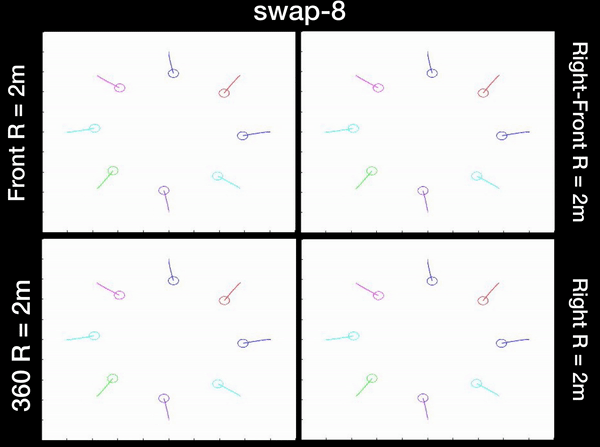

#### Mollie Bianchi
***

# Education 

<table style="width:100%">
  <tr>
    <td> 
      <b> Master of Applied Science, Emphasis in Robotics </b>  
      <i> University of Toronto, Autonomous Space Robotics Lab, GPA: 4.0/4.0, 2019 - 2021</i>  
      <a href="https://news.engineering.utoronto.ca/five-u-of-t-engineering-students-recognized-with-vector-institute-scholarships-in-ai/">Vector Scholarship in Artificial Intelligence</a> and NSERC Graduate Scholarship    
      <b> Bachelor of Applied Science in Engineering Science with High Honours </b>  
      <i> University of Toronto, Robotics Major, GPA: 3.94/4.00, 2015 - 2019 </i>  
      University of Toronto National Scholarship valued at $100k    
      <a href="https://www.linkedin.com/in/mollie-bianchi-4963371a5/">View my Linked Profile</a> &nbsp; 
      <a href="https://github.com/MollieBianchi">View my GitHub Profile</a> &nbsp; 
      <a href="assets/pdfs/MollieBianchiResume.pdf">Download my Resume</a>   &nbsp; 
    </td>
    <td>

 </td>     
  </tr>
</table>

# Projects

## Visual Localization for Unmanned Aerial Vehicles

<table style="width:100%">
  <colgroup>
       <col span="1" style="width: 60%;">
       <col span="1" style="width: 40%;">
    </colgroup>
  <tbody>
    <tr>
      <td> 
        We propose and demonstrate a fast, robust method for using satellite images to localize an Unmanned Aerial Vehicle (UAV). Previous work using satellite images has large storage and computation costs and is unable to run in real time. In this work, we collect Google Earth (GE) images for a desired flight path offline and an autoencoder is trained to compress these images to a low-dimensional vector representation while retaining the key features. This trained autoencoder is used to compress a real UAV image, which is then compared to the precollected, nearby, autoencoded GE images using an inner- product kernel. This results in a distribution of weights over the corresponding GE image poses and is used to generate a single localization and associated covariance to represent uncertainty. Our localization is computed in 1% of the time of the current standard and is able to achieve a comparable RMSE of less than 3m in our experiments, where we robustly matched UAV images from six runs spanning the lighting conditions of a single day to the same map of satellite images.
      </td>
      <td>
        

         
        

      </td>
    </tr>
  </tbody>
  </table>

## Simulation Testing for aUToronto, [UofT's Self Driving Car Team](https://www.autodrive.utoronto.ca)

Worked as the simulation lead links to winning articles 1st Place Team Overall Years [1](https://www.utoronto.ca/news/u-t-s-autoronto-team-wins-first-competition-autodrive-challenge), [2](https://betakit.com/u-of-ts-self-driving-car-dominates-2019-autodrive-challenge/), and [3](https://www.utoronto.ca/news/third-year-running-u-t-engineering-team-wins-international-self-driving-car-challenge) in the AutoDrive Challenge hosted by SAE and General Motors 1st Place in the MathWorks Simulation Challenge Years 2 and 3 Author on [“Zeus: A system description of the two-time winner of the collegiate SAE auto drive competition.”](https://arxiv.org/abs/2004.08752) in the Journal of Field Robotics, 2020.  Worked with existing simulation solutions (MATLAB’s Automated Driving Scenario, CARLA which is powered by Unreal Engine, RightHook) to create specific dynamic evaluation scenarios Created a ROS bridge to interface between developed autonomy nodes and output from the simulation 



* * *

## Evaluating Preferred Velocity Methods Used with ORCA

<table style="width:100%">
  <colgroup>
       <col span="1" style="width: 60%;">
       <col span="1" style="width: 40%;">
    </colgroup>
  <tbody>
    <tr>
      <td> 
        The <a href="">ORCA method </a> is a procedure for finding the closest collision-free velocity to a preferred velocity for each robot in a multi-robot environment. The computation of this preferred velocity is separate from the collision avoidance and is generally achieved using traditional motion planning techniques. The only restriction is that it must be computed quickly as the collision avoidance procedure is computation heavy. Exactly how it was computed was excluded from the original paper. The preferred velocity is important in order to prevent deadlock situations and to ensure smooth paths. This project implements the ORCA method from scratch in MATLAB and presents and evaluates a method for computing the preferred velocity.  
      <a href="assets/pdfs/PlanningFinalReport.pdf"> Project Report </a> &nbsp;  <a href="https://github.com/MollieBianchi/planning_project"> View on GitHub </a> &nbsp;  <a href="https://youtu.be/DuNtqT4eaR4"> View Video </a>
      </td>
      <td>
        

         
        

      </td>
    </tr>
  </tbody>
  </table>

## Evaluating Efficient Goal Selection Methods for Hindsight Expereince Replay

<table style="width:100%">
  <colgroup>
       <col span="1" style="width: 60%;">
       <col span="1" style="width: 40%;">
    </colgroup>
  <tbody>
    <tr>
      <td> 
      Often in Reinforcement Learning (RL) the reward function is a binary signal that depends on whether or not the goal has been reached. Only if the agent achieves the goal does it receive a reward. This means an extremely large amount of samples are required before the agent is able to learn. Hindsight Experience Replay (HER) is a method that replays past experiences with a new goal. This has increased the sampling efficiency and practicality of RL on problems with sparse rewards. However, currently the new goals are picked based on a hand-crafted heuristic. This project looks at a new method which selects replay goals that the agent is able to learn the most from. This is achieved by selecting goals that maximize the Bellman error. This method was evaluated on 1D and 2D robotic goal search problems and compared against the existing Future and Final goal selection methods.  
        <a href="assets/pdfs/ControlsFinalReport.pdf"> Project Report </a> &nbsp;  <a href="https://github.com/MollieBianchi/controls_project"> View on GitHub </a> &nbsp;  <a href="https://youtu.be/YPvrOWMDQbc"> View Video </a>
      </td>
      <td>
        

          
        

      </td>
    </tr>
  </tbody>
  </table>

## Localizing from Simulated Data

<table style="width:100%">
  <colgroup>
       <col span="1" style="width: 60%;">
       <col span="1" style="width: 40%;">
    </colgroup>
  <tbody>
    <tr>
      <td> 
      Localization is a key aspect of any self-driving vehicle but relying solely on GPS can result in offsets from a given semantic map. Visual localization is a cost effective solution that works by registering live images with images stored in a map. This work presents a method for finding the 3DoF relative pose change between real images captured at Mcity and simulated geo-referenced images from an Mcity simulation, and is intended for use in a visual localization pipeline. It also investigates the use of synthetic data during training to increase performance.  
        <a href="assets/pdfs/PerceptionFinalReport.pdf">Project Report</a> &nbsp;  <a href="https://youtu.be/qMyTl605iYE"> View Video </a>
      </td>
      <td>
        

          
        

      </td>
    </tr>
  </tbody>
  </table>

## Can Sorting Machine

1st place team in the full semester course competition to design and construct a fully autonomous can sorting machine capable of seperating cans into tin cans with label, tin cans without label, pop cans with tab, and pop cans without tab.
• Design and fabricate the machine structure
• Select and install appropriate sensors, actuators, and motors
• Integrate with electrical and microcontroller components



 

 

# Work Experience

<table style="width:100%">
  <colgroup>
       <col span="1" style="width: 50%;">
       <col span="1" style="width: 50%;">
    </colgroup>
  <tbody>
    <tr>
      <td> 
      <b> IT and Controls Intern									Summer 2018 </b>  
<i>Innovative Automation Inc., Barrie, Ontario </i>  
Developed and deployed WinForms and ASP .Net applications in C# for use in production including modifications to the SQL database
Programmed PLCs for the operation of automated robotic equipment and designed Human Machine Interfaces
Troubleshot machine operations and rework design during testing phase  

<b> IoT App Developer Intern									Summer 2017 </b>  
<i>More Automation Solutions Inc., Mississauga, Ontario </i>  
Built Windows Universal Platform and web based applications for industrial IoT products 
Generated databases to store sample records using SQLite
Developed accompanying graphical user interfaces for viewing database records using HTML and Angular JS 
Used OpenCV to analyze loaves of bread travelling along a conveyor for quality control
      </td>
      <td>
        

            
        

      </td>
    </tr>
  </tbody>
  </table>

 

 

# Fun Stuff


