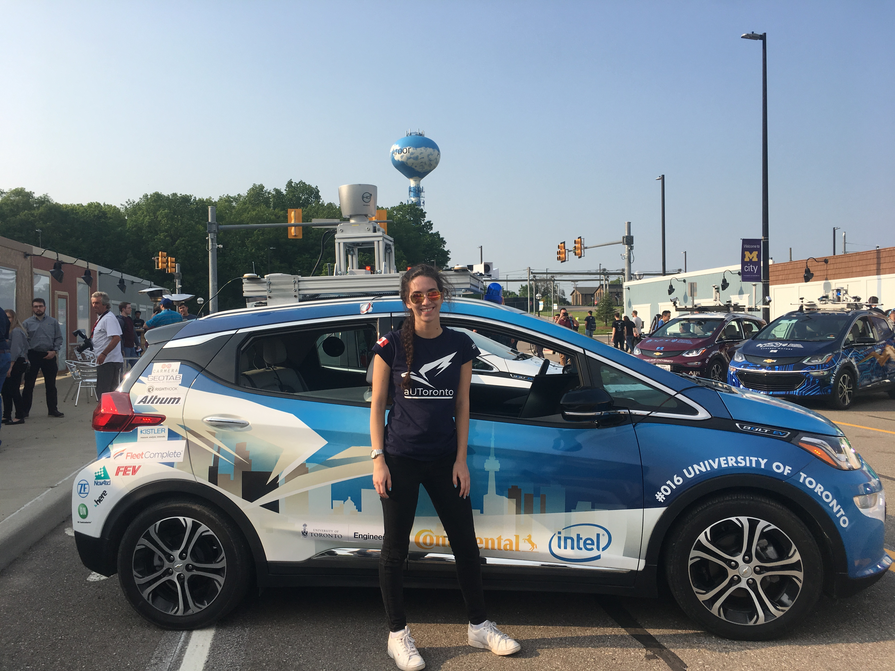
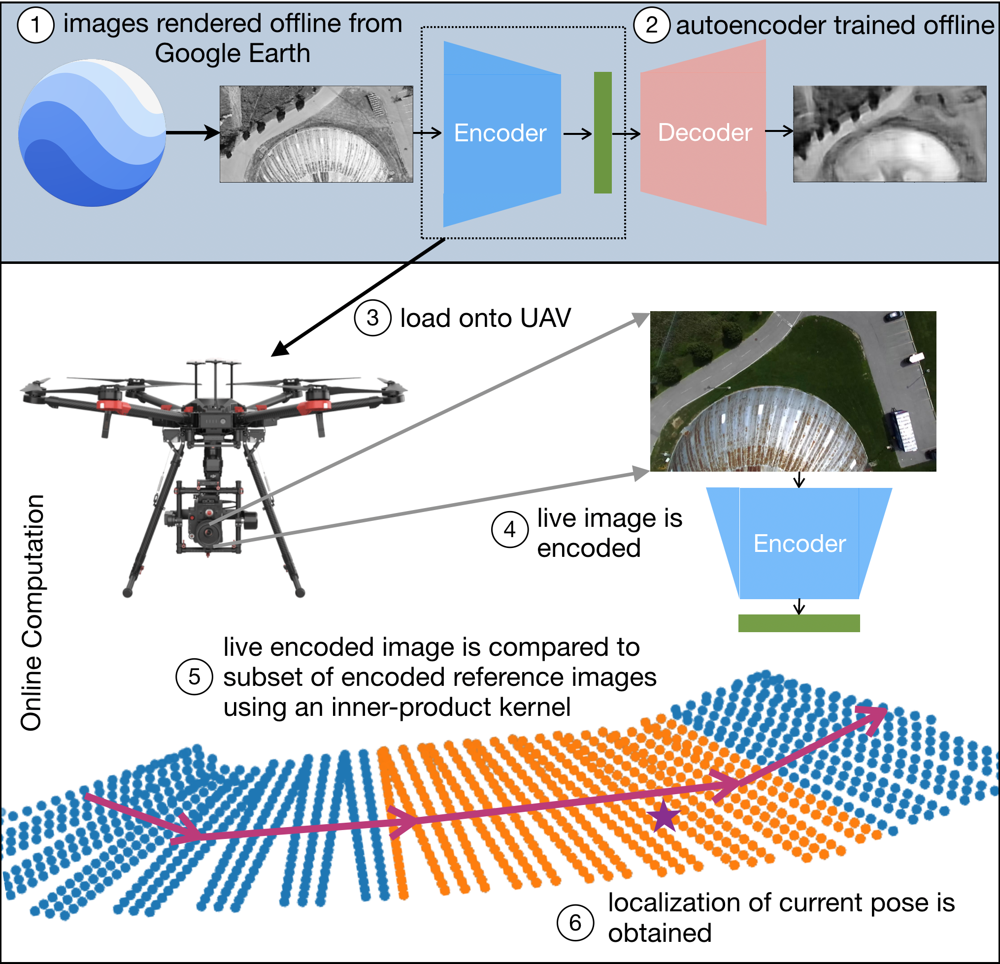
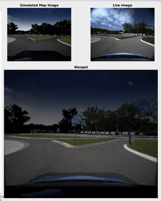

# Mollie Bianchi
***

# Education 

<table style="width:100%">
  <tr>
    <td> 
      <b> Master of Applied Science, Emphasis in Robotics &nbsp; 2019 - 2021 </b>  
      <i> University of Toronto, Autonomous Space Robotics Lab, GPA: 4.0/4.0 </i>  
      <a href="https://news.engineering.utoronto.ca/five-u-of-t-engineering-students-recognized-with-vector-institute-scholarships-in-ai/">Vector Scholarship in Artificial Intelligence</a> and NSERC Graduate Scholarship    
      <b> Bachelor of Applied Science in Engineering Science with High Honours &nbsp; 2015 - 2019 </b>  
      <i> University of Toronto, Robotics Major, GPA: 3.94/4.00 </i>  
      University of Toronto National Scholarship valued at $100k    
      <a href="https://www.linkedin.com/in/mollie-bianchi-4963371a5/">View my Linked Profile</a> &nbsp; 
      <a href="https://github.com/MollieBianchi">View my GitHub Profile</a> &nbsp; 
      <a href="">Download my Resume</a>   &nbsp; 
    </td>
    <td></td>     
  </tr>
</table>

# Projects

## Visual Localization for Unmanned Aerial Vehciles
 | Current research is on 
---- | -----

## Simulation Testing for aUToronto, UofT's Self Driving Car Team
Worked as the simulation lead
links to winning articles
1st Place Team Overall Years 1, 2, and 3 in the AutoDrive Challenge hosted by SAE and General Motors
1st Place in the MathWorks Simulation Challenge Years 2 and 3
Author on “Zeus: A system description of the two-time winner of the collegiate SAE auto drive competition.” in the Journal of Field Robotics, 2020
Worked with existing simulation solutions (MATLAB’s Automated Driving Scenario, CARLA which is powered by Unreal Engine, RightHook) to create specific dynamic evaluation scenarios 
Created a ROS bridge to interface between developed autonomy nodes and output from the simulation
include videos/gifs and some description

[Website](https://www.autodrive.utoronto.ca)

Burnett, Keenan and Qian, Jingxing and Du, Xintong and Liu, Linqiao and Yoon, David J. and Shen, Tianchang and Sun, Susan and Samavi, Sepehr and Sorocky, Michael J. and Bianchi, Mollie and Zhang, Kaicheng and Arkhangorodsky, Arkady and Sykora, Quinlan and Lu, Shichen and Huang, Yizhou and Schoellig, Angela P. and Barfoot, Timothy D. "**Zeus: A system description of the two-time winner of the collegiate SAE autodrive competition.**" _Journal of Field Robotics_. 2020.  [arXiv:2004.08752 [cs.RO]](https://arxiv.org/abs/2004.08752) 


[Video](https://youtu.be/2Z6mPKIv0TM)

## Controls Project
_Git Repo_()
Often in Reinforcement Learning (RL) the reward function is a binary signal that depends on whether or not the goal has been reached. Only if the agent achieves the goal does it receive a reward. This means an extremely large amount of samples are required before the agent is able to learn. Hindsight Experience Replay (HER) is a method that replays past experiences with a new goal. This has increased the sampling efficiency and practicality of RL on problems with sparse rewards. However, currently the new goals are picked based on a hand-crafted heuristic. This project looks at a new method which selects replay goals that the agent is able to learn the most from. This is achieved by selecting goals that maximize the Bellman error. This method was evaluated on 1D and 2D robotic goal search problems and compared against the existing Future and Final goal selection methods.
link to report
Embed Video

## Planning Project
_Git Repo_()
The ORCA method [1] is a procedure for finding the closest collision-free velocity to a preferred velocity for each robot in a multi-robot environment. The computation of this preferred velocity is separate from the collision avoidance and is generally achieved using traditional motion planning techniques. The only restriction is that it must be computed quickly as the collision avoidance procedure is computation heavy. Exactly how it was computed was excluded from the original paper. The preferred velocity is important in order to prevent deadlock situations and to ensure smooth paths. This project implements the ORCA method from scratch in MATLAB and presents and evaluates a method for computing the preferred velocity.
link to report
EMbed Video

## Perception Project
Localization is a key aspect of any self-driving vehicle but relying solely on GPS can result in offsets from a given semantic map. Visual localization is a cost effective solution that works by registering live images with images stored in a map. This work presents a method for finding the 3DoF relative pose change between real images captured at Mcity and simulated geo-referenced images from an Mcity simulation, and is intended for use in a visual localization pipeline. It also investigates the use of synthetic data during training to increase performance.

link to report


## Can Sorting Machine
Embed video

# Work Experience

# Skills

